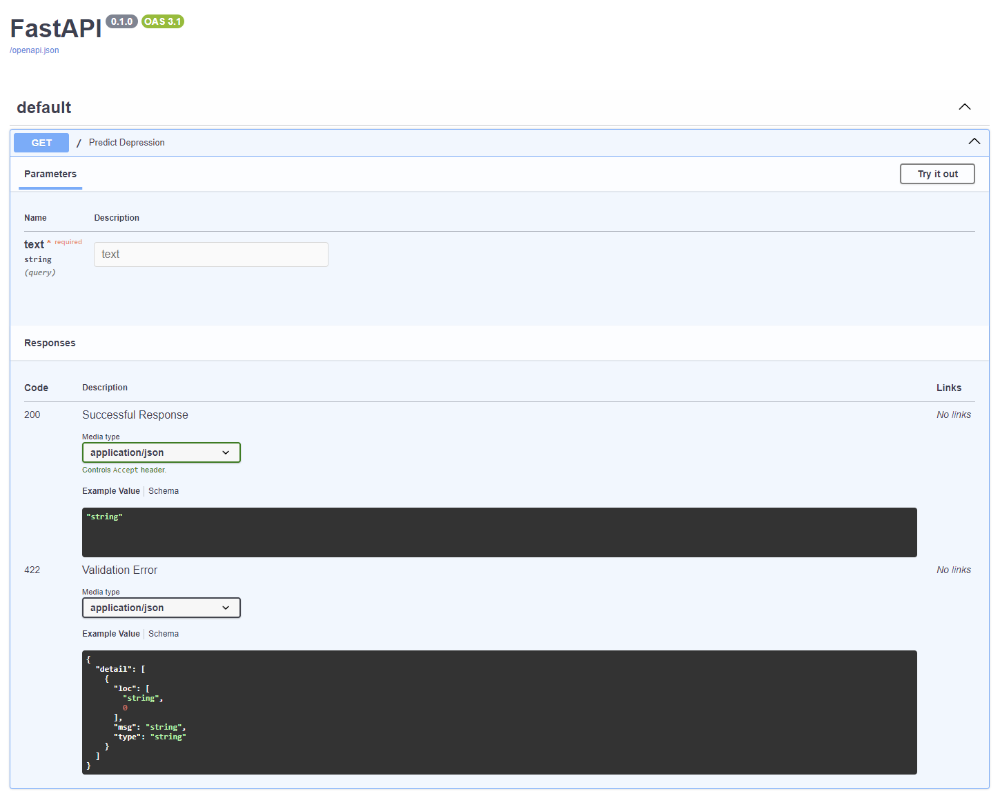

# depression-backend

# Get Started

docker pull 13tanamatef/depression_prediction

docker run -p  80:80 --memory="4g" --cpus="2" depression_prediction 

Go To http://localhost:80/docs#

Add in text and test for yourself!

